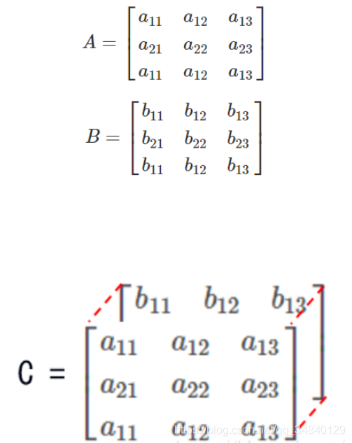
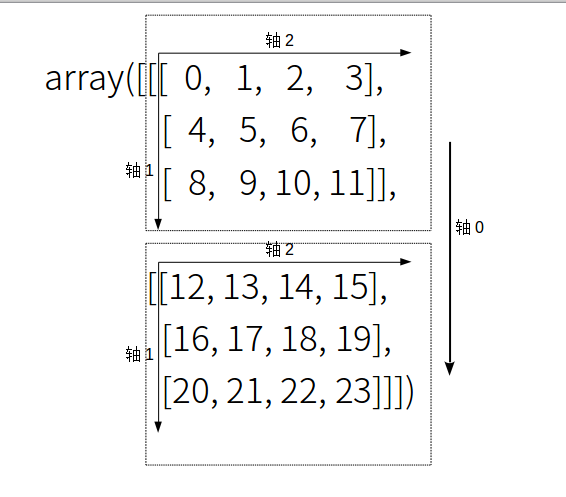
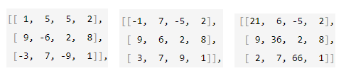
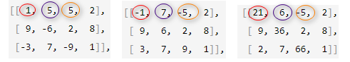
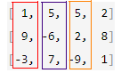

# 二/三维数组位置

<details>

<summary></summary>


</details>

## 二维轴

**0轴**代表一个矩阵里竖着的那一个方向，**1轴**代表一个矩阵里横着的那一个方向。

### axis = 0 列方向

```python
import numpy as np
arr = np.array([[3, 6, 6, 2], [4, 7, 11, 2], [5, 9, 1, 3]])
print(np.argmax(arr, axis=0))

>>>
[2 2 1 2]
```

第一步：axis=0对应最外层\[]，其内最大单位块为：\[ 3, 6, 6, 2]、 \[ 4, 7, 11, 2]和\[ 5, 9, 1, 3] \
第二步：单位块是数组，两者对应下标元素进行计算，即：argmax(\[3，4，5])、argmax(\[6，7，9])、argmax(\[6，11，1])、argmax(\[2，2，3])，得到4个最大值索引值：2、2、1、2，得到索引值数组：\[2 2 1 2]

### axis = 1 行方向

```python
import numpy as np
arr = np.array([[3, 6, 6, 2], [4, 7, 11, 2], [5, 9, 1, 3]])
print(np.argmax(arr, axis=1))

>>>
[1 2 1]
```

第一步：axis=1对应第二层\[]，其内最大单位块为：3, 6, 6, 2 和 4, 7, 11, 2 和 5, 9, 1, 3 \
第二步：单位块是数值，直接进行计算，即：argmax(\[3，6，6，2])、argmax(\[4，7，11，2])、argmax(\[5，9，1，3])，得到3个最大值索引值：1、2、1，得到索引数组：\[1 2 1]

## 三维轴

<figure><figcaption></figcaption></figure>

`数组(页，行，列)`&#x20;

0 轴代表深度方向，页的方向

1轴代表一个矩阵里竖着的那个方向

2 轴代表一个矩阵中横着的那个方向

<figure><figcaption></figcaption></figure>

```python
import numpy as np
data_array = np.arange(24).reshape(2,3,4)
# 生成一个 2 页，3 行，4 列的数组
print(data_array)

#这是第 0 页
[[[ 0 1 2 3] 
  [ 4 5 6 7]
  [ 8 9 10 11]] 
# 这是第 1 页
[[12 13 14 15]
  [16 17 18 19]
  [20 21 22 23]]]
```

```python
data2 = data_array.transpose(1,0,2)
# 即代表将轴0和1对换，轴2不变
# 亦即将arr[x][y][z]中x和y位置互换
print(data2)

print("+++++++")

data3 = data_array.swapaxes(1,2) # 轴 1 和轴 2 互换
print(data3)

>>>
[[[ 0  1  2  3]
  [12 13 14 15]]

 [[ 4  5  6  7]
  [16 17 18 19]]

 [[ 8  9 10 11]
  [20 21 22 23]]]
+++++++
[[[ 0  4  8]
  [ 1  5  9]
  [ 2  6 10]
  [ 3  7 11]]

 [[12 16 20]
  [13 17 21]
  [14 18 22]
  [15 19 23]]]
```

## axis（轴）与数组括号的对应关系

| axis     | \[ ]              |
| -------- | ----------------- |
| axis = 0 | `[` \[ \[ ] ] `]` |
| axis = 1 | \[ `[` \[ ] `]` ] |
| axis = 2 | \[ \[ `[` `]` ] ] |

### axis = 0

```python
import numpy as np
arr = np.array([[[1, 5, 5, 2], 
                 [9, -6, 2, 8], 
                 [-3, 7, -9, 1]], 
                
                [[-1, 7, -5, 2], 
                 [9, 6, 2, 8], 
                 [3, 7, 9, 1]], 
                
                [[21, 6, -5, 2], 
                 [9, 36, 2, 8], 
                 [2, 7, 66, 1]]])

print(np.argmax(arr, axis=0))

>>>
[[2 1 0 0]
 [0 2 0 0]
 [1 0 2 0]]
```

<figure><figcaption><p>第一步：axis=0对应最外层[]，其内最大单位块为</p></figcaption></figure>

<figure><figcaption><p>第二步：单位块是数组，三者对应下标元素进行计算</p></figcaption></figure>

即：argmax(\[1，-1，21)、argmax(\[5，7，6])、argmax(\[5，-5，-5])、argmax(\[2，2，2])、argmax(\[9，9，9])、argmax(\[-6，6，36])…以此类推

### axis = 1 列方向

```python
import numpy as np
arr = np.array([[[1, 5, 5, 2], 
                 [9, -6, 2, 8], 
                 [-3, 7, -9, 1]], 
                
                [[-1, 7, -5, 2], 
                 [9, 6, 2, 8], 
                 [3, 7, 9, 1]], 
                
                [[21, 6, -5, 2], 
                 [9, 36, 2, 8], 
                 [2, 7, 66, 1]]])

print(np.argmax(arr, axis=1))

>>>
[[1 2 0 1]
 [1 0 2 1]
 [0 1 2 1]]
```

<figure><figcaption><p>第一页中的元素比较</p></figcaption></figure>

另外两块进行相同的比较

### axis = 2 行方向

```python
import numpy as np
arr = np.array([[[1, 5, 5, 2], 
                 [9, -6, 2, 8], 
                 [-3, 7, -9, 1]], 
                
                [[-1, 7, -5, 2], 
                 [9, 6, 2, 8], 
                 [3, 7, 9, 1]], 
                
                [[21, 6, -5, 2], 
                 [9, 36, 2, 8], 
                 [2, 7, 66, 1]]])
                 
print(np.argmax(arr, axis=2))

>>>
[[1 0 1]
 [1 0 2]
 [0 1 2]]
```

单位块是数值，直接进行计算，即： \
argmax(\[1，5，5，2]) \
argmax(\[9，-6，2，8]) \
argmax(\[-3，7，-9，1]) \
argmax(\[-1，7，-5，2])
